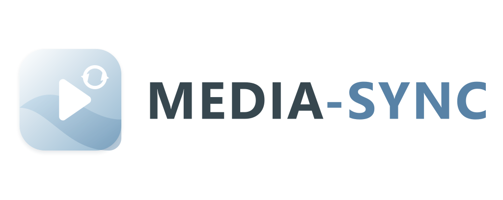

<div align="center">

<picture>
  <source media="(prefers-color-scheme: dark)" srcset="media_sync/logo-dark.png">
  
</picture>

<h3>Keeps your media library and a remote server in sync, in both directions</h3>
<p>Two-way, over an encrypted SSH connection. Deletion protection is on by default, so nothing goes without your say-so.</p>

<a href="https://github.com/mkerstner/media-sync/releases"></a>
<a href="https://github.com/mkerstner/media-sync-integration"></a>

</div>

---

Works with a NAS, a VPS or a rented storage box over SSH, and with Nextcloud
or anything else that speaks WebDAV. Everything travels encrypted.
Over SSH the app uses a key it creates for itself, so there is no password to
store. WebDAV needs one, and the documentation covers keeping that to a
revocable app password.

This repository holds the **Media Sync app**, which does the actual syncing.
Its companion, the
[Media Sync integration](https://github.com/mkerstner/media-sync-integration),
adds buttons, status and the deletion confirmation to Home Assistant.

## Install

1. Go to **Settings → Apps → ⋮ → Repositories** and add:

   ```
   https://github.com/mkerstner/media-sync
   ```

2. Find **Media Sync** in the store and install it.
3. Start it once. It creates an SSH key and prints the public half to its log.
4. Give that public key to your remote server.
5. Fill in its settings — which server, which folders.

Full details in [the app documentation](media_sync/DOCS.md).

Then install the [integration](https://github.com/mkerstner/media-sync-integration)
to drive it from Home Assistant.

## Starting a sync

Three ways, all doing the same thing:

- **From the UI** — press a button, or put one on a dashboard.
- **From an automation** — call the `media_sync.sync` action, optionally
  choosing a direction.
- **From a terminal** — the sync script runs on its own, with no Home
  Assistant involved.

However you start it, the outcome is recorded in the same place, so a run you
kick off by hand still shows up in Home Assistant.

## About deletions

When a file is on one side but not the other, there is no way to tell whether
it was deleted there or added here. So nothing is deleted automatically. The
items are listed, left alone, and Home Assistant raises a repair notification
asking you to decide.

---

By Matthias Kerstner ([@mkerstner](https://github.com/mkerstner))

Licensed under the [Apache License 2.0](LICENSE).
